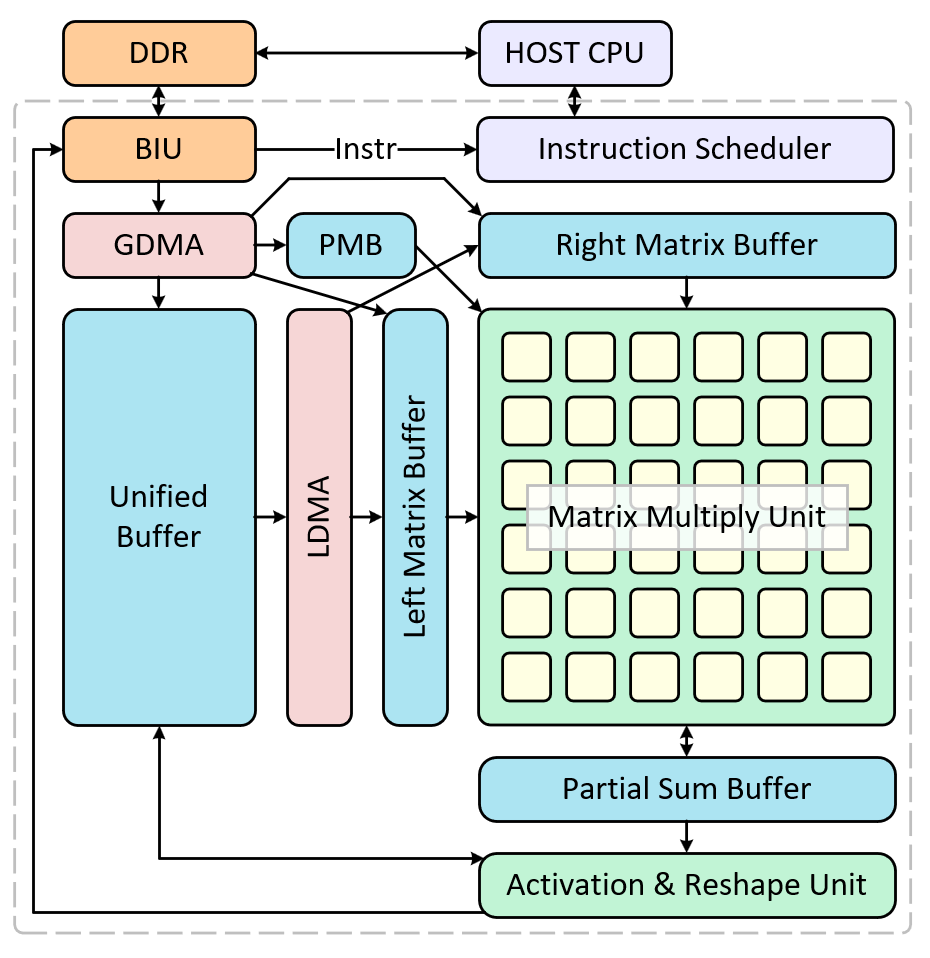

# LPU项目简介

# 前言

1. 为什么我们要做LPU？

    1. 时代背景：处于技术变革期，大语言模型是重要驱动力

    2. 市场需求：边缘端对大模型推理需求激增，未来应用前景广阔

    3. 技术局限：目前主流推理框架和LPU都针对云端推理场景设计，针对端侧大模型优化的推理框架和LPU仍然是蓝海，无论是学术界还是工业界

2. 了解NPU设计全流程

# 需求

OpenTPU支持的功能如下:

1. 支持Vision Transformer、Large Language Model、Vision Language Model推理

2. 支持ResNet、MobileNet等DNN推理

3. 矩阵乘法规格：bf16 \* bf16 \+ fp32 = fp32

4. 激活函数规格：单目、双目操作bf16，reduce操作fp32（位宽还可以更大）

    1. 激活：ReLU、GeLU、SiLU

    2. Reduce：Max、Min、Average

    3. Norm：RMSNorm、LayerNorm

    4. 非线性变化：Softmax、Sigmoid

    5. ElementWise：Add、Sub、Mul、 Div

    6. 位置编码：RoPE

    7. Mask

5. 性能

    1. bf16矩阵乘法算力：1024 MAC/cycle，M0=16，N0=K0=8

    2. 激活函数算力：32 Op/cycle，P\_ARU=4

# 整体框图



# 功能划分

1. Matrix Multiply Unit \(MXU\): 矩阵乘法

2. Activation \& Reshape Unit \(ARU\):

    1. 数据搬运：

        1. PSB\-\>UB

        2. PSB\-\>GM

        3. PSB\+UB\-\>UB

        4. UB\-\>GM

    1. 激活函数

    2. data layout转换

3. Instruction Scheduler \(IS\): 通过BIU从GM加载指令，并向各执行单元分发指令

4. Bus Interface Unit \(BIU\): 从GM读取指令、输入特征图、权重，写出输出特征图

5. Unified Buffer \(UB\): 存储输入特征图和中间计算结果

6. Left Matrix Buffer \(LMB\): 存储左矩阵

7. Right Matrix Buffer \(RMB\): 存储右矩阵

8. Parameter Buffer \(PMB\): 用于存储bias

9. Partial Sum Buffer \(PSB\): 用于存储矩阵乘法过程中的部分和

10. Activation Reshape Buffer\(ARB\): 在ARU内，用于存储激活函数的参数、量化反量化系数、reduce的计算结果

11. Global Direct Memory Access \(GDMA\):

    1. 从GM搬运数据到UB、PMB、LMB、RMB

    2. 做Data Layout转换，搬到LMB、RMB时，layout从K1MK0变换成M1K1M0K0

12. Local Direct Memory Access \(LDMA\):

    1. 将数据从UB搬运到LMB、RMB、ARB

    2. 做Data Layout转换，从MK变换成K1MK0或M1K1M0K0

# 工作流程

## 核外工作流程

1. HOST CPU从硬盘中加载指令和权重存放在GM中

2. HOST CPU将指令地址、指令条数等信息打包成Task Info发送给OpenTPU

3. OpenTPU接收到TaskInfo后取指、计算、将计算结果写到GM

4. 所有指令执行完毕后OpenTPU向HOST CPU发送中断

5. HOST CPU收到中断后去GM指定位置获取OpenTPU计算结果, 并与Golden进行比对

## 核内工作流程

（ToDo: 不同的工作场景工作流程不完全一致，暂时只给了一个场景里的工作流程）

OpenTPU通过IS与HOST CPU进行交互, 以matmul算子为例介绍工作流程如下:

1. IS从HOST CPU接收到TaskInfo，解析TaskInfo中的指令地址、指令条数等信息

2. IS根据TaskInfo中的指令地址和指令条数，从GM加载指令

3. IS接收到指令，将指令分发给各执行单元

4. GDMA从GM读左矩阵存到LMB

5. GDMA从GM读右矩阵存到UB

6. LDMA从UB读右矩阵，转置后存到RMB（$QK^T$中的K要做转置）

7. GDMA从GM读偏置存到PMB

8. MXU从LMB读左矩阵，从RMB读右矩阵，从PMB读偏置，做矩阵乘法，并将结果写到PSB

9. ARU从PSB读计算结果，做激活后写入UB或GM

10. IS向HOST CPU发送中断，告知HOST CPU当前Task计算完成

# Memory Model

## Data Path


1. GM\-\(BIU,GDMA\)\-\>UB: 需要做element wise add的矩阵存储到UB

2. GM\-\(BIU,GDMA\)\-\>LMB: 做矩阵乘法的左矩阵可以直接搬运到LMB

3. GM\-\(BIU,GDMA\)\-\>RMB: 做矩阵乘法的右矩阵可以直接搬运到RMB

4. GM\-\(BIU,GDMA\)\-\>PMB: 搬运偏置系数

5. UB\-\(LDMA\)\-\>LMB: 在Attention里，QK都是实时算出来的，因此需要一条通路把计算完的Q放到LMB

6. UB\-\(LDMA\)\-\>RMB: 在Attention里，QK都是实时算出来的，因此需要一条通路把计算完的K放到RMB

7. LMB,RMB,PMB,PSB\-\(MXU\)\-\>PSB: 矩阵乘法

8. UB\-\(ARU\)\-\>ARB：搬运量化、反量化系数、激活函数的参数到ARB

9. UB,PSB\-\(ARU\)\-\>UB：做element wsie add

10. PSB\-\(ARU\)\-\>UB: 做激活存入UB

11. UB\-\(ARU,BIU\)\-\>GM: 激活函数计算结果写到GM，仅有一条从Core到GM的通路

## Data Layout

||Matrix Multiplication Left Matrix|Matrix Multiplication Right Matrix|Matrix Multiplication Parameter|Activation Intermediate Matrix|
|---|---|---|---|---|
|GM|K1MK0|K1NK0|N||
|UB|K1MK0 //用于矩阵乘法计算|K1NK0 //用于矩阵乘法计算|N1N0|N1MN0 // 激活函数中间结果|
|L0\-IN|LMB: M1K1M0K0|RMB: N1K1K0N0|PMB: N1N0||
|L0\-Out|PSB: M1N1M0N0||||

1. GM中如果使用MK或NK储存数据，访存效率不高，在英伟达的设计里只是兜底选择。英伟达针对

2. 实现时，如果发现K1MK0可以支持整个推理过程，就不再实现MK格式。按理说，只有tokenizer会生成MK格式的矩阵，但是也可以在CPU上把MK格式的矩阵转换成K1MK0，而后续推理时只要写到GM的矩阵都按照K1MK0写，最后输出token时再由CPU把K1MK0转换成MK。

# Execution Model

OpenTPU各二级模块并行运行，由Instruction Scheduler使用set和wait管理各模块什么时候启动以保证数据依赖关系。以计算一个卷积特征图分块为例，共计需要6条指令：

1. mov2ub\_layout: GDMA从GM读取输入特征图存入UB

2. mov2rmb: GDMA从GM读取权重存入RMB

3. mov2pmb: GDMA从GM读取偏置和量化系数存入PB

4. mov2lmb\_im2col: LDMA从UB读取特征图做im2col存入LMB

5. matmul: MXU进行卷积计算

6. active: ARU做激活并将计算结果存入GM或者UB


这6条指令之间的数据依赖具体体现为:

1. mov2lmb\_im2col需要等待mov2ub\_layout完成

2. matmul需要等待mov2lmb\_im2col和mov2rmb完成

3. active需要等待matmul完成

软件通过在有数据依赖的指令之间插入set和wait完成依赖。比如在mov2ub\_layout后插入一个从GDMA指向LDMA的set\_flag，而mov2lmb\_im2col之前插入一个从GDMA指向LDMA的wait\_flag，只有mov2ub\_layout执行完才能执行set\_flag，执行完set\_flag才能执行wait\_flag，执行完wait\_flag才能执行mov2lmb\_im2col。通过这种方式实现了mov2ub\_layout执行完再执行mov2lmb\_im2col。

```Assembly language
mov2ub_layout
**set_flag(src: GDMA, dst: LDMA)**
mov2rmb
mov2pb
**set_flag(src: GDMA, dst: MXU)**
**wait_flag(src: GDMA, dst: LDMA)**
mov2lmb_im2col
**set_flag(src: LDMA, dst: MXU)**
**wait_flag(src: GDMA, dst: MXU)**
**wait_flag(src: LDMA, dst: MXU)**
matmul
**set_flag(src: MXU, dst: ARU)**
**wait_flag(src: MXU, dst: ARU)**
active
```


# LPU项目流程

## 收集需求

OpenTPU运行哪些网络？训练还是推理？要支持哪些算子？

## 定义架构

设计符合需求的处理器架构以及Memory Model和Execution Model。OpenTPU的架构、Memory Model、Execution Model目前已经确定。

## 定义指令集ISA

根据顶层需求确定每个模块需要完成的功能，并分析实现每一个功能都需要哪些信息/参数。比如LDMA把数据从UB搬运到LMB，那么数据搬运指令里就要提供数据在UB和LMB里的地址，以及要搬运数据的长度这些信息。

## Function Model验证ISA:

使用C\+\+或Python验证定义的指令集是否能够实现预期的需求。

## 设计微架构:

**梳理需求:** 梳理OpenTPU要实现的feature，包括功能特性和性能特性，不考虑实现细节。

**纵向拆分: **根据OpenTPU的feature，划分二级模块\(比如ARU，IS\)，并确定二级模块的功能、二级模块之间的接口、二级模块的工作流程；然后根据二级模块的功能划分三级模块，并确定三级模块的功能、三级模块之间的接口，直至功能不能再拆分成模块。

**横向演绎**: 一个顶层模块的功能可能需要多个二级模块共同完成，将二级模块提供的功能串在一起演绎一遍，确认各模块之间互相配合能否完成所需要的功能。

## Cycle\-Accurate Model\(CAModel\)验证微架构

使用C\+\+描述微架构，并且引入时钟周期的概念。比如在CModel里，MXU读取左矩阵的数据，就要一笔一笔读，一笔一笔算，然后将计算结果一笔一笔写到PSB，并且每个周期只能读一笔。但是在FModel里，MXU就可以通过访问数组的形式直接访问左矩阵全部数据。FModel可以作为CAModel的Golden，比如一条指令用FModel运行一次，用CModel运行一次，比较CAModel的运行结果和FModel的运行结果是否一致。CAModel可以作为RTL的Golden，比如一条指令用CModel运行一次，用RTL运行一次，除了比较最终的运行结果，还可以比较二级模块甚至三级模块之间的接口是否一致。CAModel可以评估微架构能否满足性能需求。如果发现微架构设计有问题，可以及时修改。

## RTL实现

使用验证过的微架构进行RTL设计，可以减少调试周期。FModel和CModel还可以作为Golden，评估RTL的正确性
