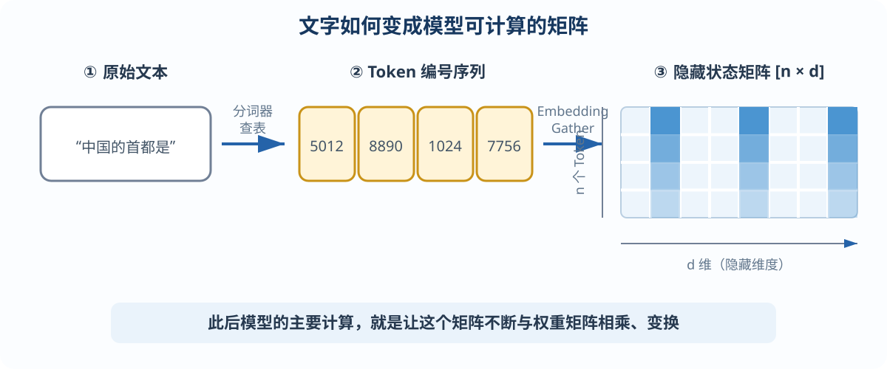
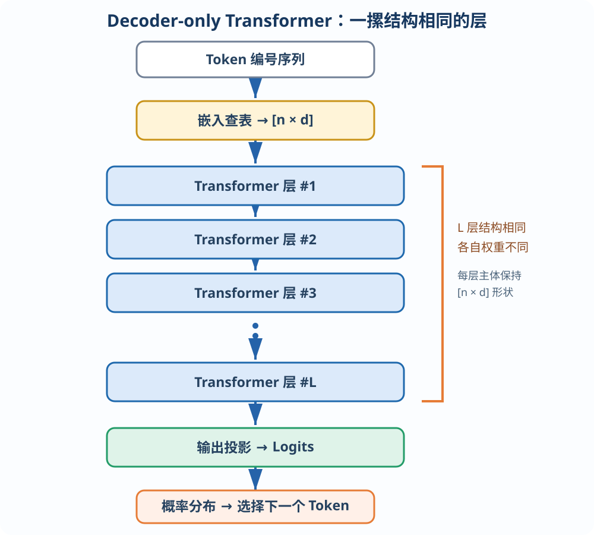
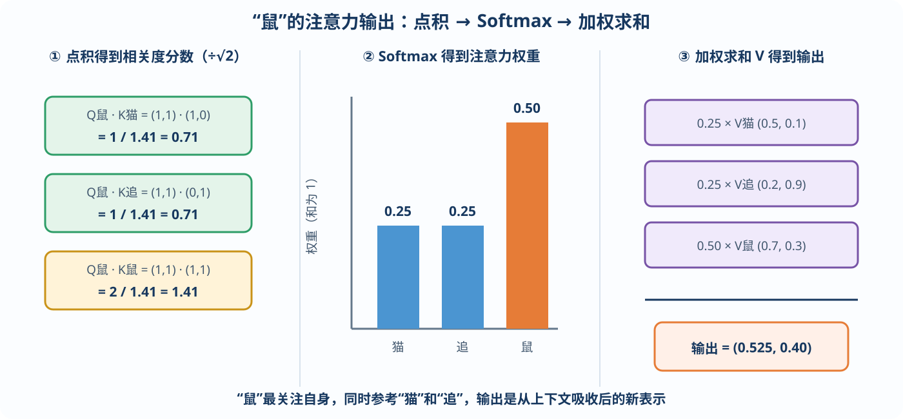
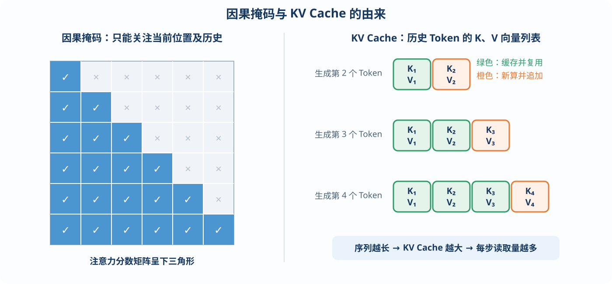
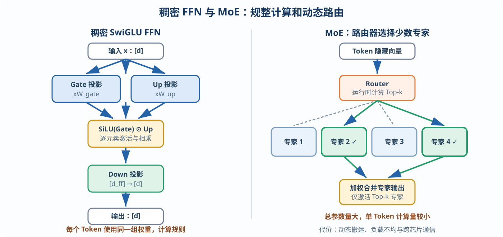
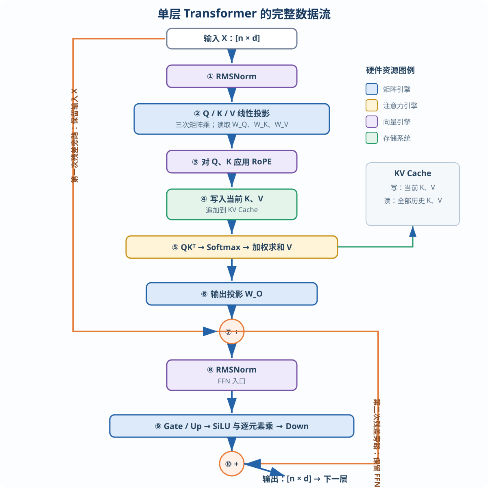

# 大模型推理芯片指南

## 前言：为什么要读这份指南，以及如何使用它

过去三年，大模型推理已经从“训练的附属品”变成整个 AI 产业中成本最高、增长最快的算力开销之一。

业界普遍估计，在一个成熟大模型产品的生命周期中，推理消耗的算力可能是训练的数倍乃至数十倍。这直接推动了 Google、OpenAI、Anthropic、Meta、Amazon 等公司投入自研或深度定制推理芯片：

> **训练芯片决定了你能造出多强的模型；推理芯片决定了你能以什么成本、什么延迟，把模型服务给多少用户。**

因此，推理芯片的每一分能效提升，都可能直接转化为产品毛利率的提升。

这份指南面向芯片工程师，以硬件执行视角解释大模型推理。阅读时建议始终追问四个问题：

1. 这一步执行了什么运算？
2. 数据从哪里读取，又写到哪里？
3. 瓶颈更可能来自算力、存储容量，还是带宽？
4. 这一步能否并行，能以多大的粒度并行？

---

# 第 1 章　写给芯片工程师的大模型算法速成

本章的目标，是让从未接触过机器学习的芯片工程师，在两三个小时内建立对大模型的正确工程认知。

我们会刻意回避训练、梯度、损失函数等与推理芯片关系不大的内容，只讨论推理阶段芯片真正需要执行的运算。这里不需要高深数学：从硬件视角看，推理阶段的大模型本质上是一台按照固定流程工作的**超大规模矩阵运算机器**。

## 本章路线图

```text
文本
  ↓ Tokenization（软件查表）
Token 编号序列
  ↓ Embedding（按索引读表）
[n × d] 数字矩阵
  ↓ 依次通过 L 个 Transformer 层
Attention → FFN → Attention → FFN → …
  ↓ 输出概率分布
选出下一个 Token，并重复整个过程
```

---

## 1.1 大模型到底在做什么：下一个 Token 预测

先建立最顶层的认知。

一个大语言模型（Large Language Model，LLM），例如 GPT、Llama、Claude，在推理时所做的事情可以概括为：

> **给定一段已有文本，预测下一个 Token；将选出的 Token 接到文本末尾，再预测下一个，如此循环，直到生成结束。**

例如，用户输入：

> 中国的首都是

模型读入这句话，经过大量计算后输出一个概率分布，例如：

| 候选 Token | 概率（示意） |
|---|---:|
| 北 | 92% |
| 位 | 3% |
| 一 | 1% |
| 其他 | 4% |

系统选中“北”，把它接到原句末尾，得到“中国的首都是北”；随后整个过程再次运行，模型预测出“京”；再运行一次，模型可能预测出表示句子结束的特殊 Token，生成随之停止。

用户看到的答案“北京”，就是这样逐个 Token 生成的。这也解释了为什么使用 ChatGPT 或 Claude 时，回答通常会以流式方式出现：这不只是前端动画，而是模型确实正在逐步生成结果。

### 对硬件设计的两个直接推论

**推论一：生成多少个 Token，模型就要迭代运行多少次。**

生成 100 个 Token，通常就需要执行 100 次解码迭代。每次迭代的耗时，直接决定用户感受到的出字速度。

**推论二：Token 生成具有天然的串行依赖。**

第 100 个 Token 必须等第 99 个 Token 生成后才能开始，因为前者要以前者之前的完整序列作为输入。它无法像一批互不相关的图片那样直接并行处理。

这两个推论，是后续所有推理性能分析的起点。

---

## 1.2 Token 与 Embedding：文字如何变成数字

芯片只认识数字，不认识汉字或英文。文字进入模型前，需要经过两步转换。

### 第一步：分词（Tokenization）

模型拥有一张固定的**词表**（Vocabulary），通常包含数万到数十万个条目，每个条目称为一个 **Token**。

Token 并不完全等于“单词”：

- 常见英文单词可能对应一个 Token；
- 较长或少见的英文单词可能被拆成多个片段，例如 `un`、`believ`、`able`；
- 一个汉字对应多少个 Token 取决于具体分词器，可能是一个，也可能被进一步拆分；
- 标点、空格和特殊控制符也可能拥有自己的 Token。

分词器通过软件查表，将输入文本转换成一串整数编号。例如，“中国的首都是”可能被转换为：

```text
[5012, 8890, 1024, 7756]
```

这一步主要是软件侧的字符串处理和查表操作，计算量相对于模型主体通常可以忽略。芯片工程师只需记住：

> **模型的输入和输出都是 Token 编号序列；后文所说的“序列长度”，就是 Token 的数量。**

### 第二步：嵌入（Embedding）

每个 Token 编号会被映射为一个高维向量。模型内部保存着一张巨大的嵌入表，其尺寸为：

$$
[\text{词表大小} \times d]
$$

其中，$d$ 称为**隐藏维度**（Hidden Size），是整个模型最重要的结构参数之一。典型取值可以从数千扩展到上万。

例如，Token 编号 `5012` 对应嵌入表的第 `5012` 行。如果 $d=4096$，这一行就是由 4096 个数字组成的向量。它可以理解为该 Token 的“语义坐标”。这些数值在训练阶段学习得到，在推理阶段则是只读常数。

对硬件而言，Embedding 本质上是一次**按索引读表（Gather）**操作。

### 贯穿全书的心智模型

> **在模型内部，每个 Token 始终表现为一个 $d$ 维向量；一段包含 $n$ 个 Token 的文本，就是一个 $[n \times d]$ 矩阵。**

模型的主要工作，就是让这个矩阵不断与不同的权重矩阵相乘、变换，最终得到下一个 Token 的概率分布。



*图 1-1　文字如何变成数字：分词 → Token 编号 → Embedding → $[n\times d]$ 矩阵*

---

## 1.3 模型的整体结构：一摞相同的层

主流大语言模型，如 GPT、Llama、Qwen 和 DeepSeek，大多采用 **Decoder-only Transformer** 架构。它的结构非常规整：

> **数据依次通过 $L$ 个 Transformer 层。每一层都对 $[n \times d]$ 矩阵做一次变换，矩阵的主体形状基本不变，内容却不断被精炼。**

层数 $L$ 和隐藏维度 $d$ 是决定模型参数量与计算量的关键结构参数。

每个 Transformer 层主要由两个串联的子模块组成：

1. **注意力模块（Attention）**：让每个 Token 从上下文中提取相关信息；
2. **前馈网络（Feed-Forward Network，FFN）**：对每个 Token 的表示做进一步变换。

为保证数值稳定和信息传递，实际模型中还会穿插归一化（如 RMSNorm）与残差连接。但从计算量和硬件资源的角度看，Attention 与 FFN 是最核心的两个模块。

```text
输入 X
  │
  ├─→ 归一化 → Attention → 残差相加
  │                         │
  └─────────────────────────┘
                            │
                            ├─→ 归一化 → FFN → 残差相加 → 输出
                            │                     │
                            └─────────────────────┘
```



*图 1-2　大模型的整体结构：数据依次穿过 $L$ 个结构相同、权重不同的 Transformer 层*

整个大模型算法，浓缩之后就是这两个模块的重复堆叠。下面先重点理解 Attention。

---

## 1.4 注意力机制：先建立直觉

注意力机制要解决的问题是：

> **处理一个 Token 时，如何参考上下文中其他 Token 的信息？**

看下面这句话：

> 银行旁边的河**岸**上长满了草。

要正确理解“岸”，必须回头看到“河”。类似地，在“他把钱存进了银行”中，“行”的具体含义也依赖前文。也就是说，每个词的真实含义取决于它与上下文中哪些词发生了关联。

注意力机制让每个 Token 主动“环顾”允许访问的其他 Token，并按照相关程度吸收信息。

### 图书馆检索类比

可以把注意力想象成一次图书馆检索：

| 角色 | 英文 | 含义 | 类比 |
|---|---|---|---|
| 查询 | Query，Q | 我想找什么信息 | 检索请求 |
| 键 | Key，K | 我这里有什么信息 | 书籍标签 |
| 值 | Value，V | 找到我后能取走的内容 | 书中内容 |

处理某个 Token 时，它拿自己的 Q 与上下文中各 Token 的 K 逐一比对，得到一组相关度分数；这些分数经过归一化后变成权重；最后，模型按照权重对所有 V 做加权求和，得到从上下文中吸收的信息。

相关度高的 Token 权重大、贡献多；无关 Token 的权重接近零，贡献很小。

这个类比中已经包含了主要硬件操作：

- Q 与 K 的“比对”是向量点积；
- 权重归一化使用 Softmax；
- 对 V 的加权求和仍然是乘加运算。

---

## 1.5 注意力的精确计算：一个手算例子

### 1.5.1 生成 Q、K、V

每个 Token 的 $d$ 维向量 $x$，分别乘以三个权重矩阵，得到 Q、K、V：

$$
Q=xW_Q, \qquad K=xW_K, \qquad V=xW_V
$$

$W_Q$、$W_K$、$W_V$ 是训练得到的权重矩阵，在推理阶段是只读常数，其尺寸通常与 $d$ 相关。

> **这一步是标准矩阵乘法，也是注意力模块的主要计算量来源之一。**

### 1.5.2 计算相关度分数

第 $t$ 个 Token 对第 $j$ 个 Token（$j\leq t$）的相关度定义为：

$$
\operatorname{score}(t,j)=\frac{Q_tK_j^{\mathsf T}}{\sqrt{d_{\text{head}}}}
$$

除以 $\sqrt{d_{\text{head}}}$ 是为了控制数值范围，避免点积随着向量维度增大而过大。

### 1.5.3 用 Softmax 得到权重

一组分数通过 Softmax 转换为和为 1 的正数权重：

$$
\operatorname{softmax}(s_j)=\frac{e^{s_j}}{\sum_k e^{s_k}}
$$

### 1.5.4 对 V 做加权求和

最终注意力输出为：

$$
\operatorname{AttnOut}(t)=\sum_j \operatorname{softmax}(\operatorname{score}(t,j))V_j
$$

### 手算示例：“猫 → 追 → 鼠”

为了便于手算，令每个头的向量维度 $d_{\text{head}}=2$。假设 Q、K、V 投影后的数值如下（仅为演示）：

| Token | Q | K | V |
|---|---|---|---|
| 猫 | — | $(1,0)$ | $(0.5,0.1)$ |
| 追 | — | $(0,1)$ | $(0.2,0.9)$ |
| 鼠 | $(1,1)$ | $(1,1)$ | $(0.7,0.3)$ |

现在计算第 3 个 Token“鼠”的注意力输出。

**第一步：计算 Q 与各个 K 的点积。**

$$
\operatorname{score}(\text{鼠},\text{猫})
=\frac{1\times1+1\times0}{\sqrt 2}
\approx0.71
$$

$$
\operatorname{score}(\text{鼠},\text{追})
=\frac{1\times0+1\times1}{\sqrt 2}
\approx0.71
$$

$$
\operatorname{score}(\text{鼠},\text{鼠})
=\frac{1\times1+1\times1}{\sqrt 2}
\approx1.41
$$

**第二步：计算 Softmax。**

三个分数的指数近似为：

$$
e^{0.71}\approx2.03,\qquad e^{0.71}\approx2.03,\qquad e^{1.41}\approx4.10
$$

总和约为 $8.16$，归一化后得到权重：

$$
(0.25,\ 0.25,\ 0.50)
$$

也就是说，“鼠”最关注自身，同时均衡地参考“猫”和“追”。

**第三步：对 V 加权求和。**

$$
\begin{aligned}
\operatorname{AttnOut}
&=0.25(0.5,0.1)+0.25(0.2,0.9)+0.50(0.7,0.3)\\
&=(0.525,0.400)
\end{aligned}
$$

这个二维向量，就是“鼠”从上下文中吸收到的信息。它将继续参与后续计算。



*图 1-3　注意力手算的完整过程：点积得到分数，Softmax 得到权重，再对 V 加权求和*

### 从手算回到真实模型

整个注意力机制可以拆成四步：

```text
矩阵投影 → 向量点积 → 指数归一化 → 加权求和
```

真实模型只是把向量维度从 2 扩展到数十或数百，把序列长度从 3 扩展到几千乃至更多 Token，并同时计算多个注意力头；基本原理完全相同。

### 因果掩码（Causal Mask）

语言模型要预测下一个 Token，因此第 $t$ 个 Token 只允许看到当前位置及其之前的 Token，即 $j\leq t$，不能“偷看未来”。这称为**因果掩码**。

数学上，通常把 $j>t$ 的分数置为负无穷，使其经过 Softmax 后权重为 0。实现时也可以跳过无效区域的计算。因此，对完整序列做注意力时，允许参与计算的区域呈下三角形：

```text
        被关注的位置 j
          1   2   3   4
位置 1    ●   ×   ×   ×
位置 2    ●   ●   ×   ×
位置 3    ●   ●   ●   ×
位置 4    ●   ●   ●   ●

●：允许关注    ×：禁止关注
```

---

## 1.6 多头注意力、GQA 与 KV Cache 的由来

### 1.6.1 多头注意力（Multi-Head Attention）

实际模型不会只计算一份注意力，而是把 $d$ 维表示划分成 $h$ 个头，每个头的维度通常为：

$$
d_{\text{head}}=\frac{d}{h}
$$

每个头独立执行注意力计算，随后将 $h$ 份结果拼接，再乘以输出矩阵 $W_O$。

直觉上，不同头可以学习不同类型的关系：有的关注语法结构，有的关注指代关系，有的关注位置或主题信息。

对硬件而言，多头注意力意味着存在多个相互独立的小型矩阵运算，具有天然的并行性。

### 1.6.2 GQA：让多个 Q 头共享 K/V

在标准多头注意力中，每个 Q 头都有对应的 K 头和 V 头。后来人们发现，多个 Q 头共享同一组 K/V，通常也能维持较好的模型效果。

例如，32 个 Q 头只使用 8 组 K/V，每 4 个 Q 头共享一组 K/V。这就是**分组查询注意力**（Grouped-Query Attention，GQA），已被 Llama、Qwen 等现代模型广泛采用。

若其他条件相同，GQA 可以显著降低 K/V 的存储量和读取带宽需求。

| 结构 | Q 头数量 | K/V 头数量 | K/V 存储特点 |
|---|---:|---:|---|
| MHA | 32 | 32 | 基准 |
| GQA | 32 | 8 | 约为 MHA 的 1/4 |
| MQA | 32 | 1 | 更小，但共享程度最高 |

### 1.6.3 KV Cache：注意力带来的关键硬件后果

生成第 100 个 Token 时，它的 Q 需要与前面所有 Token 的 K 做匹配，并读取相应的 V。历史 Token 的 K、V 在之前的迭代中已经计算过，而且不会再改变，因此没有必要重复计算。

工程实现会将每个历史 Token 的 K、V 保存起来，供后续生成步骤反复读取。这块缓存就是 **KV Cache**。

```text
生成第 1 个 Token：写入 K₁、V₁
生成第 2 个 Token：读取 K₁、V₁；写入 K₂、V₂
生成第 3 个 Token：读取 K₁…K₂、V₁…V₂；写入 K₃、V₃
                         ⋮
生成第 t 个 Token：读取全部历史 K/V；追加 Kₜ、Vₜ
```

KV Cache 会随着序列增长而线性增大。在长对话、长文档和高并发场景中，它可能达到数 GB 乃至更大，成为推理芯片容量与带宽设计的核心矛盾之一。

> **KV Cache 并不神秘：它就是所有 Transformer 层中，历史 Token 的 K、V 向量集合。自回归注意力的定义决定了生成新 Token 时必须访问这些历史信息。**



*图 1-4　因果掩码与 KV Cache：只能读取历史位置，而历史 K/V 会被缓存并在后续步骤中复用*

### KV Cache 的硬件特征

| 特征 | 硬件影响 |
|---|---|
| 随序列长度线性增长 | 长上下文需要更大存储容量 |
| 每层都要保存 K/V | 层数越多，缓存越大 |
| 解码时反复读取历史 K/V | 带宽压力持续增加 |
| 新 Token 仅追加一小段数据 | 写入量较小，但访问模式持续扩展 |
| GQA 减少 K/V 头数 | 同时降低容量与带宽需求 |

---

## 1.7 前馈网络 FFN：参数量的大头

Transformer 层的第二个核心子模块比注意力更简单。前馈网络（Feed-Forward Network，FFN，也称 MLP）对**每个 Token 独立地**执行矩阵乘和逐元素运算，不同 Token 之间没有信息交互。

它先把 $d$ 维向量扩展到更宽的中间维度 $d_{\text{ff}}$，经过非线性变换后，再投影回 $d$ 维：

```text
d 维输入 → 扩展到 d_ff → 非线性激活 → 压缩回 d 维
```

$d_{\text{ff}}$ 通常约为 $d$ 的 2.7～4 倍。现代模型大多采用 **SwiGLU** 结构，它包含三个权重矩阵，习惯上称为 Gate、Up 和 Down：

$$
\operatorname{FFN}(x)
=\left[\operatorname{SiLU}(xW_{\text{gate}})\odot(xW_{\text{up}})\right]W_{\text{down}}
$$

其中：

$$
\operatorname{SiLU}(z)=\frac{z}{1+e^{-z}}
$$

$\odot$ 表示逐元素相乘。SiLU 在硬件上可以通过查表或分段多项式近似实现。

> 公式采用“行向量右乘矩阵”的记法，与前文 $Q=xW_Q$ 保持一致。因此，$W_{\text{gate}}$ 和 $W_{\text{up}}$ 的尺寸为 $[d\times d_{\text{ff}}]$，$W_{\text{down}}$ 的尺寸为 $[d_{\text{ff}}\times d]$。

### 对硬件设计必须记住的三点

1. **FFN 是“矩阵乘 + 逐元素运算”。**它没有 Token 间交互，也不产生 KV Cache 等跨步状态。
2. **FFN 通常是参数量的大头。**三个大矩阵往往占单层参数量的约 2/3，具体比例随模型结构而变化。
3. **FFN 的计算模式高度规整。**它拥有连续、密集的大矩阵运算，是矩阵引擎利用率较高的负载。

### MoE：用动态路由换取更大的模型容量

**专家混合模型**（Mixture of Experts，MoE）把一个稠密 FFN 替换为几十乃至上百个较小的 FFN，每个小 FFN 称为一个“专家”。每个 Token 先经过轻量级路由器，再动态选择少数几个专家参与计算，常见为 Top-2、Top-4 或 Top-8。

这样做的结果是：模型拥有很大的总参数容量，但每个 Token 只激活一小部分参数，因此实际计算量远小于总参数量所暗示的规模。DeepSeek-V3、Mixtral 等均采用了 MoE 架构。

MoE 对硬件和系统的影响非常直接：

- Token 选择哪个专家，要到运行时才能确定；
- 不同专家收到的 Token 数量可能不均衡；
- 专家权重可能分布在不同芯片或不同存储区域；
- 动态路由会产生不规则的数据搬运、同步与负载均衡问题。

这对依赖静态调度的芯片尤其具有挑战，后续讨论片间互连与多芯片并行时还会再次遇到它。



*图 1-5　稠密 FFN 与 MoE：前者每个 Token 经过同一组权重，后者由路由器动态选择少数专家*

---

## 1.8 归一化、残差与位置编码：不可忽略的配角

一个 Transformer 层中还有三个计算量不大、但硬件必须支持的组件。

### 1.8.1 残差连接（Residual Connection）

每个子模块的输出都要与它的输入相加：

$$
y=x+\operatorname{Attention}(x)
$$

FFN 子模块外也有同样的残差连接。硬件上，这只是一次向量加法；但它意味着原始输入向量必须一直保留到子模块计算完成，因而会影响片上缓冲区容量、数据驻留时间和生命周期规划。

### 1.8.2 归一化（RMSNorm / LayerNorm）

现代大模型常在 Attention 和 FFN 的入口处使用 RMSNorm。其核心形式为：

$$
y_i=\frac{x_i}{\sqrt{\frac{1}{d}\sum_{j=1}^{d}x_j^2+\varepsilon}}\,\gamma_i
$$

其中，$\gamma_i$ 是训练得到的缩放参数，$\varepsilon$ 是防止除零的小常数。

RMSNorm 需要先对整个 $d$ 维向量求平方和并完成归约，再计算倒数平方根，最后逐元素缩放。它的总计算量不大，却是一个天然同步点：在全向量的统计量得到之前，归一化结果无法完成。这会打断纯逐元素流水，需要在数据通路和缓冲设计中单独考虑。

### 1.8.3 位置编码（RoPE）

注意力点积本身并不知道 Token 的先后顺序。为了让模型区分“猫追鼠”和“鼠追猫”，需要向 Q、K 注入位置信息。

主流模型通常采用 **旋转位置编码**（Rotary Position Embedding，RoPE）。它把 Q、K 中每对相邻元素视为二维坐标，并按照 Token 位置旋转一定角度：

$$
\begin{bmatrix}
x'_{2i}\\
x'_{2i+1}
\end{bmatrix}
=
\begin{bmatrix}
\cos\theta_{p,i} & -\sin\theta_{p,i}\\
\sin\theta_{p,i} & \cos\theta_{p,i}
\end{bmatrix}
\begin{bmatrix}
x_{2i}\\
x_{2i+1}
\end{bmatrix}
$$

其中，角度 $\theta_{p,i}$ 同时取决于 Token 位置 $p$ 和维度索引 $i$。旋转后的 Q、K 做点积时，结果便自然携带相对位置信息。

硬件实现通常预先准备 sin/cos 表，对 Q、K 成对执行旋转乘加。它计算较轻，但每层、每个 Token 都要执行。

### 三个组件的硬件特征

| 组件 | 主要运算 | 关键硬件影响 |
|---|---|---|
| Residual | 向量加法 | 输入需保留到子模块结束 |
| RMSNorm | 平方、归约、倒数平方根、缩放 | 全向量同步点，影响流水 |
| RoPE | 查表、逐对旋转乘加 | Q/K 必做，访问位置相关参数 |

---

## 1.9 汇总：一层 Transformer 的完整数据流

现在把 1.4～1.8 节的组件按照实际执行顺序串起来。以下以常见的 Pre-Norm、SwiGLU、GQA 模型为例；不同模型的细节可能略有差异，但主体流程一致。

| 步骤 | 操作 | 主要硬件资源 |
|---:|---|---|
| ① | 对输入 $X$ 执行 RMSNorm | 向量引擎、归约单元 |
| ② | 分别乘 $W_Q$、$W_K$、$W_V$，生成 Q/K/V | 矩阵引擎、权重存储 |
| ③ | 对 Q、K 应用 RoPE | 向量引擎、sin/cos 表 |
| ④ | 将当前 K、V 追加到 KV Cache | 存储系统 |
| ⑤ | Q 与历史 K 点积，Softmax 后对 V 加权求和 | 注意力引擎、KV Cache 带宽 |
| ⑥ | 注意力结果乘输出矩阵 $W_O$ | 矩阵引擎、权重存储 |
| ⑦ | 与原输入做第一次残差相加 | 向量引擎、片上缓冲 |
| ⑧ | 对残差结果执行 RMSNorm | 向量引擎、归约单元 |
| ⑨ | 执行 Gate/Up 投影、SiLU、逐元素乘和 Down 投影 | 矩阵引擎、向量引擎 |
| ⑩ | 与 FFN 输入做第二次残差相加，得到本层输出 | 向量引擎、片上缓冲 |



*图 1-6　单层 Transformer 的完整数据流：Attention 和 FFN 各自被归一化与残差连接包围*

从硬件视角，可以把一层中的工作归纳为四类：

**A. 大矩阵乘。**包括 Q/K/V/O 投影与 FFN 的 Gate/Up/Down 投影，共约 7 个主要权重矩阵，是计算量与参数量的绝对主体。

**B. 注意力核心。**包括 QK 点积、Softmax、对 V 加权求和，以及与 KV Cache 的交互。

**C. 向量运算。**包括 RMSNorm、RoPE、SiLU、逐元素乘和残差加法。它们计算量较小，但种类多、数据依赖各异。

**D. 存储读写。**包括模型权重读取、KV Cache 读写，以及中间激活的片上搬运。

这四类工作直接对应推理芯片的四个核心部分：

> **矩阵引擎、注意力引擎、向量引擎和存储系统。**

后续章节将围绕它们分别展开定量分析与设计。

---

## 1.10 从概率到文字：输出层与采样

最后一层 Transformer 输出的 $d$ 维向量，还需要转换成词表中每个 Token 的分数。这个过程称为**输出投影**：

$$
\text{logits}=xW_{\text{vocab}}
$$

其中，$W_{\text{vocab}}$ 的尺寸为 $[d\times |V|]$，$|V|$ 表示词表大小。输出得到的 $|V|$ 个原始分数称为 **Logits**。对 Logits 执行 Softmax 后，就得到下一 Token 的概率分布。

从概率分布中选出下一个 Token 的策略称为**采样**（Sampling）：

- **Greedy（贪心）**：总是选择概率最高的 Token，结果稳定但容易单调；
- **Temperature（温度）**：先用温度 $T$ 缩放 Logits，$T$ 越低越保守，越高越随机；
- **Top-k**：只保留概率最高的 $k$ 个候选；
- **Top-p**：保留累计概率达到阈值 $p$ 的最小候选集合。

温度缩放可以写成：

$$
P_i=\operatorname{softmax}\!\left(\frac{\text{logit}_i}{T}\right)
$$

采样本身计算量很小，可以放在主机 CPU 或片上标量核执行，不需要大型专用计算单元。但硬件设计仍需注意两点：

1. **输出投影矩阵并不小。**它的参数量为 $d\times |V|$，每生成一个 Token 都要执行一次投影；部分模型会让输出投影与输入 Embedding 共享权重。
2. **采样位于逐 Token 串行循环的关键路径。**如果每步都在设备与主机之间往返，会增加解码延迟。常见做法是把“采样 → 生成新 Token → 回填输入”的闭环放在设备侧完成。

```text
最后一层隐藏状态
        ↓ 输出投影
      Logits
        ↓ 温度 / Top-k / Top-p
   候选概率分布
        ↓ 采样
   下一个 Token
        └────────→ 回填模型，开始下一轮解码
```

---

## 1.11 本章自测

合上本章，尝试回答以下问题。若能用自己的话完整解释，就可以进入第 2 章。

1. 模型生成 50 个 Token 的回答，解码阶段大致要执行多少次网络前向迭代？为什么这些迭代不能简单并行？
2. Q、K、V 分别扮演什么角色？请用图书馆检索类比说明。
3. KV Cache 中存储的到底是什么？为什么它随对话变长而增大？为什么生成新 Token 时要读取历史 K/V？
4. 一层 Transformer 中，参数量主要集中在哪两类矩阵？
5. Softmax、RMSNorm、RoPE 分别出现在什么位置？在硬件上对应哪些操作？
6. GQA 和 MoE 分别改造了哪个模块？它们分别给存储、带宽、调度和互连带来什么影响？
7. 为什么说残差连接虽然只是向量加法，却会影响片上缓冲区规划？
8. 一层 Transformer 的运算可以归纳为哪四类？它们分别对应芯片中的哪些主要模块？

---

## 本章小结

完成本章后，应建立以下工程认知：

1. 大模型通过逐 Token 预测生成文本，解码过程具有天然的串行依赖。
2. 文本经过 Tokenization 和 Embedding 后，变成 $[n\times d]$ 数字矩阵。
3. 模型主体由 $L$ 个 Transformer 层堆叠而成，每层的核心是 Attention 与 FFN。
4. Attention 负责 Token 间的信息交互，并引出随序列增长的 KV Cache。
5. FFN 对各 Token 独立计算，结构规整，通常是模型参数量的大头。
6. RMSNorm、RoPE、激活与残差计算量较小，却会影响同步、流水和缓冲设计。
7. 输出投影与采样完成“隐藏向量 → 下一个 Token”的闭环。

从芯片视角看，整章最终可以归结为一句话：

> **矩阵乘需要算力，权重与 KV Cache 需要容量，持续搬运数据需要带宽，而逐 Token 闭环决定了端到端延迟。**

后续性能分析将定量判断：在不同推理阶段、模型规模、序列长度和批量下，究竟是哪一种资源首先成为瓶颈。

**第一章结束。**
