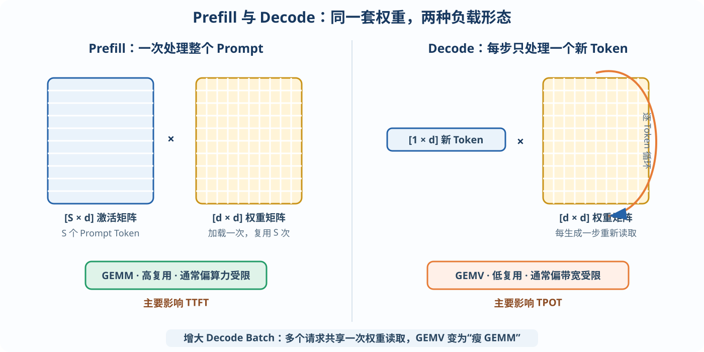
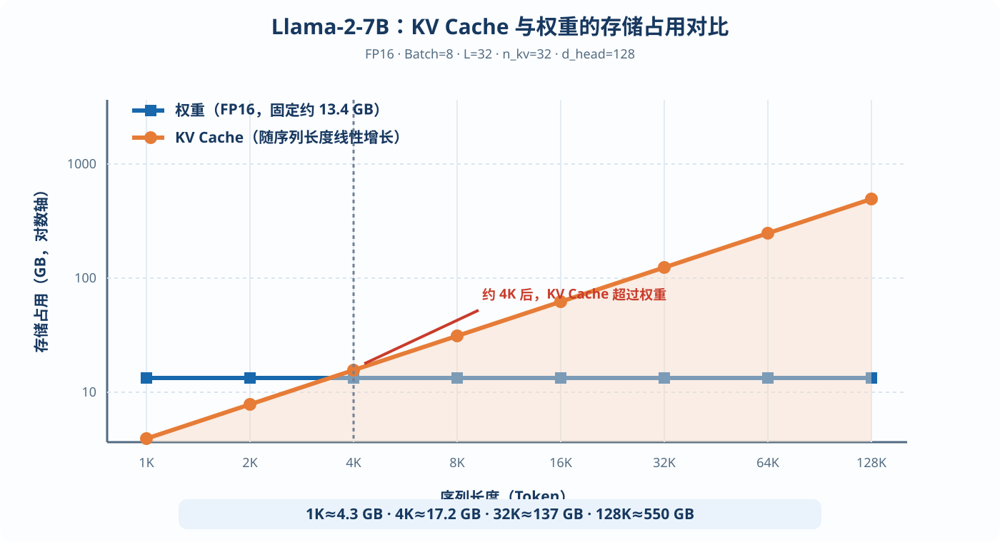
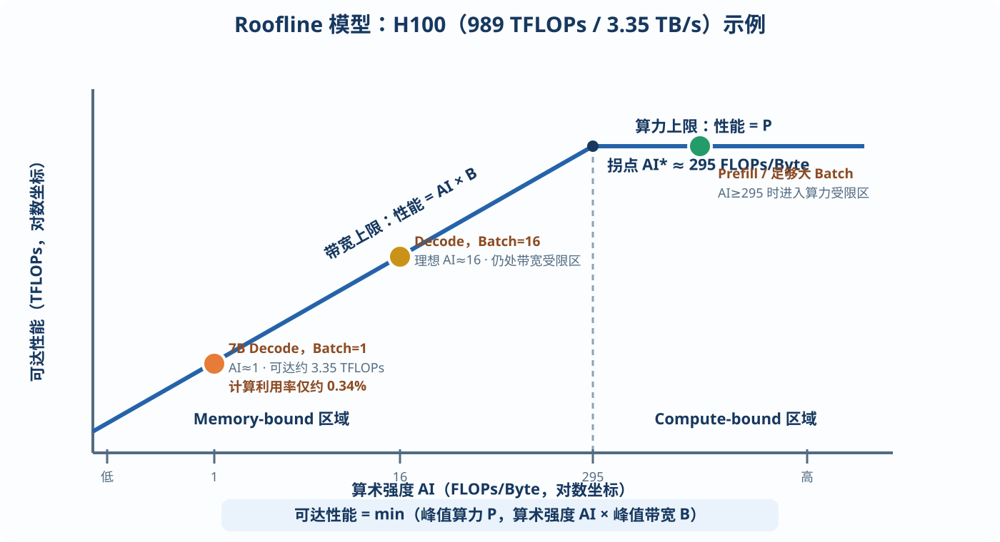

# 大模型推理芯片指南

# 第 2 章　推理负载分析：芯片设计的第一性原理

设计任何领域专用芯片（DSA，Domain-Specific Architecture）的第一步都不是画架构框图，而是把目标负载彻底吃透。

第 1 章我们弄清了大模型“算什么”，本章回答“算多少、搬多少”：你必须能闭着眼睛写出模型每一层的计算量、参数量、访存量，并理解它们随批大小（Batch Size）和序列长度如何变化。

本章建立的这套“负载直觉”和 Roofline 分析方法，是全书的地基。

---

## 2.1 先学会数数：参数量与计算量

**参数量**就是模型所有权重矩阵的元素总数。

以 Llama-2-7B 为例：$L=32$ 层，$d=4096$，注意力 32 头，$d_{ff}=11008$，词表大小为 32000。

每层的权重如下：

- Q、K、V 与输出投影四个矩阵约有：

$$
4d^2=4\times4096^2\approx67.1\text{ M}
$$

- FFN 三个矩阵约有：

$$
3dd_{ff}=3\times4096\times11008\approx135.3\text{ M}
$$

- 每层合计约 202M 个参数，32 层共约：

$$
202\text{ M}\times32\approx6.48\text{ B}
$$

- 加上嵌入表和输出投影：

$$
2\times32000\times4096\approx0.26\text{ B}
$$

总计约 6.7B，与“7B”的标称吻合。

> **FFN 约占三分之二，印证了 1.7 节的说法。**

**计算量**有一条极其好用的估算法则：

> **生成 1 个 Token 的浮点运算量 ≈ 2 × 参数量。**

道理很直白：Token 的向量流过每个权重矩阵时，矩阵的每个元素恰好参与一次乘法和一次加法，也就是 2 FLOPs。

7B 模型每生成一个 Token，大约需要 13.5 GFLOPs。

注意力部分，也就是与 KV Cache 交互的计算量需要另计。它正比于当前序列长度，短序列下占比很小，长序列下不可忽略——2.4 节会单独分析。

> **“2 × 参数量”这个法则请刻进肌肉记忆，它是所有推理性能估算的起点。**

**访存量**同样重要：生成 1 个 Token，所有权重矩阵都要被完整地读一遍——每个参数读一次；此外还要读取整个 KV Cache，并读写激活。

用 FP16 存储时，每个参数占 2 Byte。7B 模型每生成一个 Token，仅权重访存量就约为：

$$
6.7\text{ B}\times2\text{ Byte}=13.4\text{ GB}
$$

把计算量和访存量放在一起看，你会发现一个惊人的比值——这就是下一节的主题。

---

## 2.2 Prefill 与 Decode：两种截然不同的负载

大模型推理分为两个阶段。它们的硬件特征差异之大，以至于业界已经出现“两阶段使用两种机器”的部署架构，也就是 PD 分离（Prefill-Decode Disaggregation）。

理解本节，是理解一切推理芯片设计决策的钥匙。

**Prefill（预填充）阶段：**模型一次性处理用户输入的全部 Prompt，例如 2000 个 Token。

这 2000 个 Token 的向量拼成一个 $[2000\times d]$ 矩阵，与权重矩阵 $[d\times d]$ 相乘。这是典型的**大矩阵乘（GEMM）**。

关键在于：权重矩阵从内存加载一次，就被 2000 行输入复用了 2000 次。它属于计算密集型负载，能较容易地打满芯片算力。

Prefill 的耗时决定了**首 Token 延迟**（TTFT，Time To First Token）。

**Decode（解码）阶段：**模型逐个生成输出 Token。每一步只处理一个新 Token，也就是用 $[1\times d]$ 向量乘以 $[d\times d]$ 权重矩阵——这是**矩阵-向量乘（GEMV）**。

每加载一份权重只使用一次，毫无复用。生成 100 个 Token，就要把全部权重从显存完完整整地读取 100 遍。

Decode 的每步耗时决定了**出字速度**（TPOT，Time Per Output Token）。



*图 2-1　Prefill 与 Decode：同一颗芯片上两种截然不同的负载*

| 维度 | Prefill | Decode（Batch=1） |
|---|---|---|
| 计算形态 | GEMM（矩阵 × 矩阵） | GEMV（向量 × 矩阵） |
| 权重复用次数 | Prompt 长度（数百～数万） | 1 |
| 瓶颈 | 算力（Compute-bound） | 访存带宽（Memory-bound） |
| 算术强度 | 高，通常可达数百 FLOPs/Byte | 极低，约 1～2 FLOPs/Byte |
| 对芯片的诉求 | 大算力矩阵引擎 | 大带宽、低访存延迟 |
| 用户体验指标 | TTFT（首字延迟） | TPOT（出字速度） |

> **设计要点：不要只为其中一个阶段优化。**

新手最常见的错误，是只盯峰值算力 TOPS——这有利于 Prefill；或者只盯带宽——这有利于 Decode。

真实业务中，两个阶段都要运行。即使采用 PD 分离，也必须在规格阶段明确你的芯片定位于哪一侧。

Decode 可以通过**加大 Batch**，让多个用户的请求同时解码，共享同一遍权重读取，从而把 GEMV 变回“瘦 GEMM”。这正是连续批处理（Continuous Batching）技术的硬件意义，也是推理芯片必须认真优化小 Batch 维度 GEMM 的原因。

---

## 2.3 KV Cache 的定量分析

第 1 章已经从算法上解释了 KV Cache 的由来，现在算清它的账。

KV Cache 的大小公式为：

$$
\boxed{
\begin{aligned}
\text{KV 字节数}
={}&2\;\text{（K 和 V 两份）}\times L\times n_{kv}\times d_{head}\\
&\times\text{序列长度}\times\text{每元素字节数}\times\text{Batch}
\end{aligned}
}
$$

以 Llama-2-7B 为例：

```text
L = 32
KV 头数 = 32
d_head = 128
序列长度 = 4096
Batch = 8
数据格式 = FP16，每元素 2 Byte
```

则 KV Cache 大小为：

$$
2\times32\times32\times128\times4096\times2\text{ B}\times8
\approx17.2\text{ GB}
$$

它已经超过权重本身的 13.4 GB。



*图 2-2　KV Cache 与权重的存储占用对比（Llama-2-7B，Batch=8）*

长上下文（128K+）场景下，KV Cache 是绝对的存储主体。

这就是为什么 GQA、MQA、MLA 等“压缩 KV”的算法创新层出不穷。MLA 是 DeepSeek 使用的多头潜在注意力，它进一步把 KV 压缩为低秩形式。

芯片设计者必须紧密跟踪这些算法，因为它们会直接改写芯片的存储规格。

KV Cache 带来三重硬件压力：

**容量压力：**如上所示，KV Cache 会随序列长度和 Batch 迅速增长。

**带宽压力：**Decode 每生成一个 Token，都要把当前序列的全部 KV 读取一遍。序列越长，每个 Token 的注意力访存量越大；而这部分访存“读一个数只做一次乘加”，属于纯 Memory-bound 负载。

**管理压力：**不同用户请求的序列长度动态增长、随时结束，因此 KV 显存分配是一个动态内存管理问题。

vLLM 提出的 PagedAttention 把 KV Cache 按固定大小的“页”管理，已经成为事实标准。它对硬件的要求是：注意力引擎必须高效支持非连续、分页地址的 KV 读取，第 4 章将详细讨论。

---

## 2.4 算术强度与 Roofline 模型

Roofline 是推理芯片架构师最重要的分析工具：一张图讲清楚“这个负载在这颗芯片上到底卡算力，还是卡带宽”。

定义**算术强度**（Arithmetic Intensity，AI）：

$$
\boxed{
AI=\frac{\text{计算量（FLOPs）}}{\text{访存量（Bytes）}}
}
$$

也就是“从内存搬进来每个字节，平均能喂饱多少次计算”。

芯片有两个硬上限：峰值算力 $P$（FLOPs/s）和峰值带宽 $B$（Bytes/s）。实际可达性能为：

$$
\boxed{
\text{可达性能}=\min(P,\ AI\times B)
}
$$

以 AI 为横轴、性能为纵轴画图，得到一条先斜升、后平坦的“屋顶线”：斜线段是带宽上限，水平段是算力上限。

两段的交点：

$$
AI^*=\frac{P}{B}
$$

称为**拐点（Ridge Point）**：负载的算术强度低于拐点，则受限于带宽（Memory-bound）；高于拐点，则受限于算力（Compute-bound）。



*图 2-3　Roofline 模型：一张图看清负载卡算力还是卡带宽*

### 算例 2-1：H100 跑 7B 模型 Decode（Batch=1），理论出字速度是多少？

H100 SXM 的 FP16 稠密算力约为 989 TFLOPs，HBM3 带宽约为 3.35 TB/s。

拐点为：

$$
AI^*=\frac{989\times10^{12}}{3.35\times10^{12}}
\approx295\text{ FLOPs/Byte}
$$

Decode 一步的计算量约为 13.5 GFLOPs；访存量约为 13.4 GB 的权重，短序列时暂时忽略 KV Cache。

算术强度约为：

$$
AI\approx\frac{13.5\times10^9}{13.4\times10^9}
\approx1.0\text{ FLOP/Byte}
$$

它比拐点低两个数量级，属于极度 Memory-bound。

每步耗时由带宽决定：

$$
t\approx\frac{13.4\text{ GB}}{3.35\text{ TB/s}}
\approx4.0\text{ ms}
$$

理论上限约为 250 Token/s。

此时算力利用率仅为：

$$
\frac{13.5\times10^9}{4.0\times10^{-3}\times989\times10^{12}}
\approx0.34\%
$$

一颗接近 1000 TFLOPs 的芯片，在 Decode、Batch=1 时，99.6% 的算力都在发呆。

这就是行话“推理芯片本质上是在买带宽”的由来，也是 Groq 选择 SRAM-only 架构、各家拼命堆 HBM 的根本原因。

### 算例 2-2：Batch 开到多大，Decode 才能从带宽受限变成算力受限？

Batch=$N$ 时，$N$ 个请求共享同一遍权重读取：计算量增加 $N$ 倍，权重访存量不变，权重部分的算术强度近似变为 $N$。

要达到拐点，需要：

$$
N\approx295
$$

但是，KV Cache 的访存量随 Batch 线性增长，而且不同请求之间不能共享。它会把有效算术强度继续往下拖，实际所需 Batch 更大，而 KV 容量又限制了 Batch 上限。

结论是：

> **真实部署中，Decode 几乎永远受带宽限制，KV Cache 是主要的“带宽税”。**

这套分析请练到能在白板上三分钟内完成。

### 算例 2-3：注意力部分的计算量什么时候不可忽略？

除权重矩阵乘以外，注意力核心——Q·K 点积与注意力权重·V 加权和——每个 Token 的计算量约为：

$$
4Ld\times\text{当前序列长度}
$$

GQA 不改变这一项，因为它由 Q 头的总维度决定。

对于 7B 模型（$L=32$，$d=4096$）：

- 序列长度为 1K 时，约 0.54 GFLOPs，只占权重部分 13.5 GFLOPs 的 4%；
- 序列长度为 32K 时，约 17.2 GFLOPs，已经超过权重部分；
- 序列长度为 128K 时，约为权重部分的 5 倍。

结论是：短上下文中，“2 × 参数量”法则足够准确；长上下文推理中，注意力连同 KV 访存会反客为主，芯片的注意力引擎与 KV 通路设计将主导整体性能。

---

## 2.5 推理的关键业务指标

芯片规格必须翻译成业务语言。推理服务有四个核心指标：

**TTFT：**首 Token 延迟，由 Prefill 算力决定。交互式应用通常要求小于 1 秒。

**TPOT：**每 Token 间隔，由 Decode 带宽决定。超过人的阅读速度，也就是小于约 50 ms、超过 20 Token/s，才有较好的体验。

**吞吐量：**整机每秒产出的总 Token 数，决定单位硬件能服务多少用户。

**每百万 Token 成本：**由吞吐与总拥有成本（TCO）共同决定，是最终的商业指标。

芯片设计中的一切取舍——算力配比、SRAM 容量、HBM 数目、互连拓扑——最终都要投影到这四个数字上。

注意：延迟与吞吐之间存在根本性权衡。加大 Batch 可以提升吞吐，却会拉长单请求的 TPOT。

因此，规格书必须写明目标运营点，例如：

> **在 TPOT ≤ 40 ms 的约束下，最大化每卡吞吐。**

而不是孤立地追求某个峰值数字。
