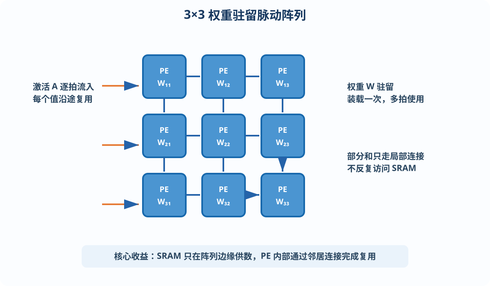
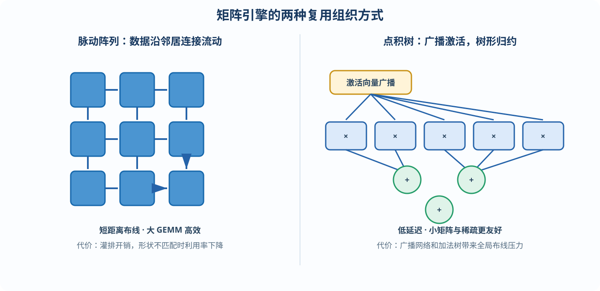
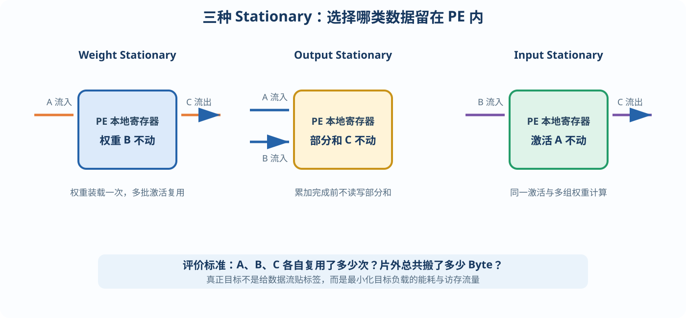
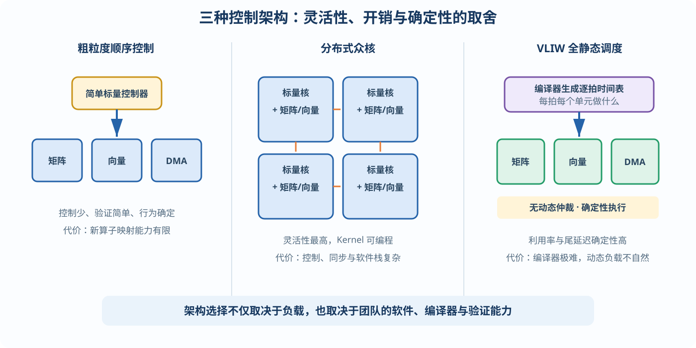

# 大模型推理芯片指南

# 第 3 章　推理加速器体系结构基础

吃透负载之后，本章讨论“用什么样的硬件结构去承接它”。

推理加速器的设计空间可以概括为四个问题：

1. 计算单元怎么组织——矩阵引擎；
2. 数据怎么在计算单元之间流动——数据流；
3. 非矩阵操作怎么办——向量与特殊函数单元；
4. 谁来指挥全局——控制架构。

本章逐一展开，并且比上一版讲得更慢、更细：每个结构都会给出“它为什么长这样”的推理过程。

---

## 3.1 从 CPU、GPU 到专用加速器：为什么要做专用芯片

先回答一个根本问题：CPU 和 GPU 都能做矩阵乘，为什么还要专门设计推理芯片？

### CPU 为什么不行

打开一颗现代 CPU 的版图，你会发现真正执行乘加的 ALU 只占很小一角，绝大部分晶体管花在了取指、译码、乱序执行、分支预测、多级缓存和一致性协议上。

这些机构存在的意义，是加速“不规则、难预测”的通用程序。但第 1、2 章已经证明，大模型推理是**极度规则**的负载：执行哪些矩阵乘、什么顺序、什么形状，在模型加载时基本就已经确定了，没有那么多分支需要预测，也没有复杂乱序执行的必要。

CPU 为通用性付出的面积和功耗，在这个负载上的利用率很低，能效比（TOPS/W）通常远低于专用加速器。

### GPU 为什么可以，但不完美

GPU 用“成千上万个简单核心 + SIMT 批量调度”摊薄了控制开销，后来又加入 Tensor Core，专门执行小块矩阵乘。它已经是一种“半专用”架构，这正是 GPU 统治 AI 计算的技术基础。

但 GPU 毕竟还要兼顾图形、科学计算和各种 AI 负载，因此保留了庞大的通用寄存器堆、动态调度器和通用缓存层次。这些通用性开销依然存在，而且执行时间的不确定性，对追求稳定尾延迟的在线服务并不友好。

### 专用加速器的核心思想

专用加速器的核心思想可以浓缩为一句话：

> **用负载的规律性，换取控制开销的消灭。**

既然 95% 左右的计算是形状可预知的矩阵乘，就可以用一条极简的控制流驱动一个巨大而“呆板”的矩阵引擎，把省下来的面积和功耗投入乘加单元（MAC）和片上存储（SRAM）。

Google TPU v1 论文中的经典数据是：在当时对比条件下，TPU 的每瓦推理性能可达到同期 GPU 的数十倍。这就是专用化红利。

当然，天下没有免费午餐，代价是灵活性。模型结构一旦偏离设计假设，例如出现 MoE 动态路由或新的注意力变体，专用芯片的效率可能迅速下降。

> **推理芯片设计的永恒主题，就是在“专用化红利”与“算法演进风险”之间寻找平衡点。**

| 处理器 | 控制与通用性 | 矩阵计算效率 | 灵活性 | 典型优势 |
|---|---|---|---|---|
| CPU | 最高 | 较低 | 最高 | 复杂控制、串行逻辑 |
| GPU | 中等 | 高 | 高 | 通用并行计算、成熟生态 |
| 专用加速器 | 最低 | 最高 | 较低 | 能效、面积效率、确定性 |

---

## 3.2 矩阵引擎（一）：先想清楚朴素做法差在哪

设计矩阵引擎前，先考虑一个朴素方案：放置 1 万个乘加器，每拍让每个乘加器从 SRAM 读取两个操作数，计算完成后再写回。

问题立刻暴露：1 万个单元每拍需要 2 万个读端口。SRAM 端口极其昂贵，这个方案在物理上根本不可行。

所以，矩阵引擎设计的真正命题不是“怎么摆乘加器”，而是：

> **如何让每个从 SRAM 读出的数据，被尽可能多的乘加器复用，从而把存储端口需求压到可实现的程度？**

矩阵乘天然适合复用。对于：

$$
C=A\times B
$$

$A$ 的每一行要与 $B$ 的每一列相乘，同一个数据本来就要被使用很多次。

矩阵引擎的两大流派——脉动阵列与点积树——本质上是两种不同的“组织复用”的方式。

---

## 3.3 矩阵引擎（二）：脉动阵列，逐拍看懂

**脉动阵列（Systolic Array）**是 TPU 采用的经典结构。

它是一个 $N\times N$ 的处理单元（PE）网格。每个 PE 只包含一个乘加器和少量寄存器，并且只与上下左右的邻居连接——没有全局总线。

数据像心脏泵血一样，按照节拍在阵列中一格一格地流动，“脉动”由此得名。每个数据流经一串 PE，并沿途被反复使用。

### 以权重驻留为例

以常见的**权重驻留（Weight Stationary）**变体为例：

1. 配置阶段，先把权重块装入各 PE 的本地寄存器中，并在计算期间保持不动；
2. 计算阶段，激活从阵列边缘逐拍流入，在相邻 PE 之间传递；
3. 每个 PE 用本地权重与经过的激活做乘加；
4. 部分和在 PE 或相邻连接中累积，最终从阵列边缘流出。

对于 $3\times3$ 的示例，每一拍都会有新的激活进入阵列，前一拍的数据继续向相邻 PE 移动。经过灌入、稳定计算和排空后，阵列开始连续输出 $C=A\times W$ 的结果。



*图 3-1　权重驻留脉动阵列：权重固定在 PE 内，激活逐拍流动，部分和沿局部连接累积*

它的关键收益是：

- 每个激活值只从 SRAM 读取一次，却能被一整行或一整列 PE 使用；
- 每个权重装载一次后，可以在整个矩阵块计算期间复用；
- 部分和全程在 PE 寄存器或相邻连接中传递，不占用 SRAM 带宽。

一个 $128\times128$ 阵列共有 16384 个 MAC，每拍却只需从 SRAM 边缘馈入约 128 个数。端口需求下降了两个数量级，这就是脉动阵列对 3.2 节命题的回答。

脉动阵列还有一个常被低估的优点：

> **布线全部是短距离的邻居连接，没有复杂的全局互连，物理设计非常友好，容易做大，也容易提高频率。**

TPU 各代的矩阵单元采用过 $128\times128$ 或 $256\times256$ 等规模的阵列。

### 脉动阵列的弱点

它的弱点同样必须牢记：**利用率对矩阵形状敏感。**

当 GEMM 的某个维度小于阵列尺寸时，对应的行或列 PE 就会空转。Decode、Batch=1 的 GEMV 是最极端的情况：如果直接映射到 $128\times128$ 阵列，$M=1$ 会导致大部分行闲置。

此外，阵列开工时需要**灌入（Fill）**，收工时需要**排空（Drain）**，两者都会带来约 $N$ 拍的固定开销。

只考虑灌入和排空开销时，可以粗略估算利用率：

$$
U\approx\frac{K}{K+2N}
$$

其中，$K$ 是累加深度，$N$ 是阵列边长。

例如：

| $K$ | $N$ | 近似利用率 $U$ |
|---:|---:|---:|
| 4096 | 128 | 约 94% |
| 128 | 128 | 约 33% |

矩阵很大时，灌排开销容易被摊薄；矩阵较小时，这笔固定成本就非常显著。

因此，**阵列尺寸不能拍脑袋决定**：大阵列峰值算力密度高，小而多的阵列对小矩阵利用率更好。必须把目标负载的矩阵形状分布放进模拟器中扫参决定，第 8 章实战会完成这项工作。

---

## 3.4 矩阵引擎（三）：点积树流派

另一大流派是**宽向量点积单元**：一排乘法器并行工作，例如一次处理 64 对操作数，输出接入一棵加法树，在流水线中完成一个长度为 64 的向量点积。

它的复用方式与脉动阵列不同：把同一个激活向量广播给多组点积单元，每组装载权重矩阵的不同列，从而并行计算输出向量的多个元素。

NVIDIA Tensor Core 和许多手机 NPU 都采用了类似思想的小分块结构。

### 与脉动阵列的比较

| 维度 | 脉动阵列 | 点积树 / 点积块 |
|---|---|---|
| 数据传递 | 相邻 PE 逐拍传递 | 激活广播到多组单元 |
| 固定开销 | 有灌入、排空 | 较少 |
| 小矩阵利用率 | 容易下降 | 通常更好 |
| 结果延迟 | 需经过阵列传播 | 较短 |
| 稀疏支持 | 较难加入跳零 | 较容易加入 |
| 物理布线 | 局部、规则 | 加法树与广播网络压力较大 |

点积树的优点是没有大阵列的灌入排空开销，小矩阵下利用率更好，数据到结果的延迟也更短，而且容易加入“跳零”逻辑利用稀疏性。

缺点是加法树本身具有布线深度，操作数广播网络也需要长距离连接，物理实现压力比“只连接邻居”的脉动阵列更大。

现代设计常常采用折中方案：

> **用许多中等规模的点积块拼成大引擎，例如使用多个 $32\times32$ 块，兼顾利用率和物理可实现性。**

一个实用的选型直觉是：

- 以 Prefill 或大 Batch 为主的芯片，脉动阵列的极简与规整通常更占优势；
- 以 Decode、小 Batch 为主要目标的芯片，点积块结构往往更合适。

这又是一个“负载决定结构”的例子。



*图 3-2　两类矩阵引擎：脉动阵列通过邻居传递组织复用，点积树通过广播与归约组织复用*

---

## 3.5 数据流策略：三种 Stationary 与“搬数据比算数据贵”

矩阵乘 $C=A\times B$ 涉及三类数据：

- 输入激活 $A$；
- 权重 $B$；
- 输出部分和 $C$。

**数据流（Dataflow）策略**回答的问题是：把哪一类数据“钉”在 PE 的本地寄存器里不动（Stationary），让另外两类数据流动，以最大化最昂贵那类搬运的复用。

经典数据流可分为三类：

| 数据流 | 驻留的数据 | 主要复用对象 | 适合场景 |
|---|---|---|---|
| Weight Stationary | 权重 $B$ | 权重 | 权重大、复用周期长 |
| Output Stationary | 部分和 $C$ | 输出累加 | 避免频繁读写部分和 |
| Input Stationary | 激活 $A$ | 输入激活 | 输入可被多个权重重复使用 |



*图 3-3　三种典型数据流：选择权重、输出部分和或输入激活驻留在 PE 本地*

### 为什么要如此计较数据放在哪里

因为搬运数据的能耗远高于计算本身。下面是一组用于建立量级直觉的典型数值，具体数值会随工艺和存储结构变化，但相对关系长期成立：

| 操作 | 典型能耗量级 |
|---|---:|
| 一次 32 位乘加 | 约 1～4 pJ |
| 读取本地寄存器 | 约 1 pJ |
| 读取大容量片上 SRAM | 约 10～50 pJ |
| 读取片外 DRAM / HBM | 约 500～1000 pJ |

一次片外存储访问的能耗，可能是一次计算的几百倍。

因此，整个数据流设计可以浓缩为一句话：

> **让每个从 DRAM 读进来的字节，在片上被尽可能多次复用后再丢弃。**

评估任何数据流方案的方法也随之明确：计算它对 $A$、$B$、$C$ 三类数据分别实现了多少倍复用，以及 DRAM 总流量是多少 Byte。第 8 章的性能模型会把这套方法完整落地。

### 分块（Tiling）

真实矩阵，例如 $4096\times11008$，远大于 $128\times128$ 阵列和片上 SRAM，必须切成小块分批处理：外层循环遍历各个块，内层由阵列处理单个块。

分块方式决定了每块数据从 DRAM 进入片上后能复用多少次，是数据流策略在 SRAM 层次的延伸。

分块尺寸的选择原则是：

> **在 SRAM 能够容纳，并为双缓冲留出空间的前提下，让复用次数最多的维度块尽可能大。**

双缓冲将在 4.2 节介绍。分块搜索通常由编译器自动完成，但硬件架构师必须亲手推导几遍，才能设计出对编译器友好的存储结构。

---

## 3.6 向量单元与特殊函数：5% 的计算量，50% 的设计心思

矩阵乘以外的操作——第 1 章数据流图中的 ①③⑤⑦⑧⑩ 等步骤——只占约 5% 的计算量，却可能花掉一半的设计精力；如果处理不好，还会成为 Amdahl 定律意义上的瓶颈。

下面逐个分析 LLM 必需的向量操作及其硬件对策。

### Softmax

Softmax 是注意力第⑤步的核心。数值稳定的传统实现需要三次遍历：

1. 第一遍求最大值；
2. 第二遍计算 $\exp(x-x_{max})$ 并求和；
3. 第三遍用指数值除以总和。

所有分数先减去最大值再求指数，否则 $e^x$ 可能溢出。这称为**数值稳定化**，硬件必须支持。

Exp 函数可以用查表加分段线性插值，或使用多项式逼近实现，达到 FP16 所需精度即可。

真正重要的是算法层面的改造：**Online Softmax**，也就是 FlashAttention 使用的流式算法。

它在流式接收分数的同时维护“当前最大值 $m$”和“当前指数和 $s$”。每来一批新分数，就使用修正因子：

$$
e^{m_{old}-m_{new}}
$$

把旧的累计值折算到新的基准下。

这样，尺寸为 $[\text{序列长}\times\text{序列长}]$ 的注意力分数矩阵不需要完整物化到内存，可以一边计算、一边消化。

这已经是现代注意力引擎的标配。向量单元指令集必须支持“带运行时最大值与指数和修正的融合累加”这类操作。

### RMSNorm / LayerNorm

RMSNorm 和 LayerNorm 对整个隐藏向量——通常包含 4096～16384 个元素——执行统计归约。

硬件上通常使用树形加法归约网络。更重要的是，它们是**同步点**：整条向量没有到齐，就无法完成归一化，因此会天然切断流水。调度器必须在此处安排好缓冲与衔接。

### RoPE

RoPE 对 Q、K 中每对相邻元素执行二维旋转：

$$
(x,y)\leftarrow
(x\cos\theta-y\sin\theta,\ x\sin\theta+y\cos\theta)
$$

Sin/Cos 按位置预先计算并存表，运行时对每一对元素执行 4 次乘法和 2 次加法。它本身很轻量，但每个 Token、每一层都必须执行，吞吐必须跟上矩阵引擎的输出速率。

### 激活函数与逐元素操作

这类操作包括：

- FFN 中的 SiLU；
- SwiGLU 的逐元素乘；
- 两次残差加法；
- 各种缩放、类型转换与量化操作。

使用查表或多项式逼近，配合 SIMD 逐元素通路即可实现。难点不在单个操作，而在于种类多，并且会随算法演进不断新增。

### 设计要点：配比，以及务必可编程

向量单元与矩阵引擎的算力配比失衡，是新手架构最常见的翻车点。

以 FlashAttention 为例，矩阵引擎每算完一批 Q·K 点积，向量单元就要立刻执行 Exp 和修正累加。如果向量吞吐不足，矩阵引擎会被反压而空转，峰值算力就成为摆设。

建议做法是：枚举目标模型的全部算子，统计“矩阵 FLOPs：向量元素操作数”的比例；考虑两者流水重叠后，再给向量单元保留至少 2 倍余量。因为算法演进——新的激活函数、归一化和位置编码——几乎总是在向量侧增加工作。

同理，向量单元必须保持**可编程性**，哪怕只提供一套简单的 SIMD 指令集。它是整颗芯片应对算法变化的主要缓冲带：

> **矩阵引擎可以高度专用，向量单元不能完全做死。**

---

## 3.7 控制架构：谁来指挥这些引擎

矩阵引擎、向量引擎和 DMA 都有了，谁来协调它们？

控制平面有三种主流风格。选择哪一种，是架构定义阶段的重大决策。

### 风格一：粗粒度指令 + 简单顺序控制

这是 TPU 路线。

主机通过 PCIe 下发少量 CISC 风格的粗粒度指令，例如：

```text
从地址 X 装载权重块
执行一次 128 × 128 × N 矩阵乘
对缓冲区 Y 执行激活函数
```

片上极简标量控制器按顺序取指，并展开为微操作，驱动各个引擎；引擎之间使用固定流水衔接。

优点是控制逻辑很少、验证简单、行为确定；缺点是灵活性最低，新算子如果无法映射到现有指令，就很难支持。

首次设计推理芯片的团队，通常适合从这种风格起步。

### 风格二：众核，每核自带标量处理器

这是 GPU 和许多 NPU 的路线。

芯片由几十到上百个核组成，每个核拥有自己的取指译码单元，常使用 RISC-V 等标量处理器；核内再挂接矩阵和向量单元。

它的灵活性最高，新的算子可以通过编写 Kernel 支持；代价是每个核都有控制开销，还要处理核间同步，并需要投入庞大的软件栈。

### 风格三：VLIW + 编译器全静态调度

这是 Groq 路线。

硬件中尽量不做动态仲裁，不依赖 Cache 或复杂握手。每一拍每个功能单元做什么、每个数据在什么时刻到达哪条通路，都由编译器在编译阶段精确排定，因此执行时间可以逐拍预测，也称为**确定性执行**。

优点是硬件利用率高、延迟确定性强；缺点是编译器难度极大，而且面对 MoE 路由、变长 Batch 等动态负载时不够自然。



*图 3-4　三种控制风格：顺序粗粒度控制、分布式众核和编译器全静态调度*

### 如何选择

| 控制风格 | 硬件控制开销 | 灵活性 | 软件难度 | 延迟确定性 |
|---|---:|---:|---:|---:|
| 粗粒度顺序控制 | 低 | 低 | 较低 | 高 |
| 分布式众核 | 高 | 高 | 高 | 较低 |
| VLIW 静态调度 | 很低 | 中低 | 很高 | 最高 |

一个常被忽视的判断依据是**团队结构**：

- 风格三意味着编译器团队的规模和能力要求可能超过硬件团队；
- 风格二要求长期投入庞大的软件生态；
- 风格一对软件要求最低，却把赌注押在“负载长期稳定”上。

架构选择从来不只是技术问题，也是组织能力问题。第 7 章的案例会反复印证这一点。
