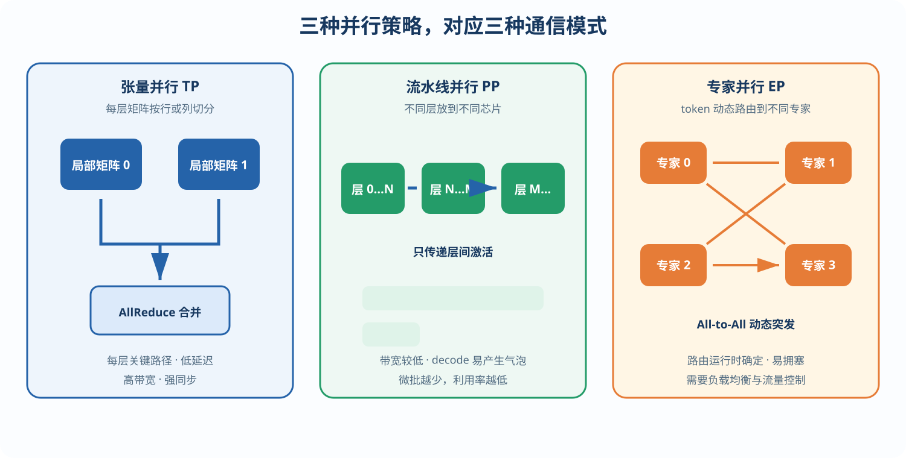
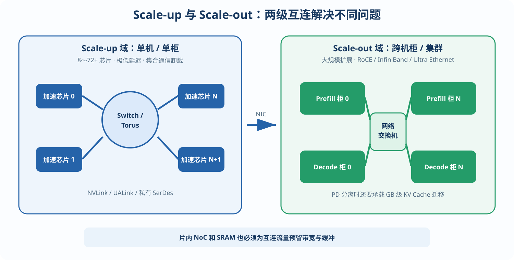
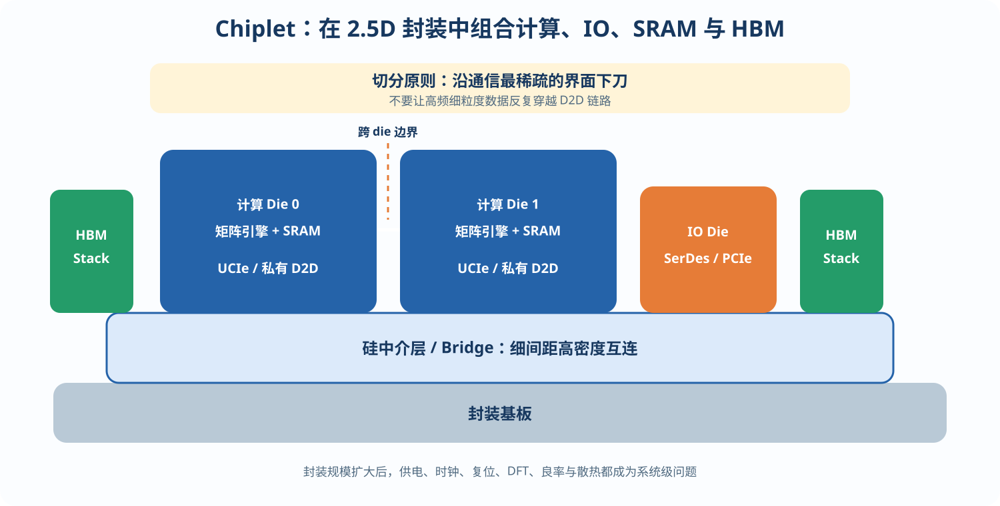

# 第 6 章 互连与规模化：从单芯片到集群

## 6.1 为什么单芯片装不下，以及三种并行策略

前沿模型（数百 B 至数 T 参数，多为 MoE 结构）的权重加 KV Cache 远超单芯片的存储，推理必然是多芯片系统，而芯片的互连设计与软件采用的并行策略深度耦合——**互连规格必须按目标并行方案反推，而不是事后附加**。

三种主要并行方式对互连的要求截然不同：

**张量并行（TP， Tensor Parallelism）**：把每个权重矩阵按行或列切到多颗芯片上，各芯片算局部结果后合并。合并操作叫 **AllReduce**（所有芯片的局部向量逐元素相加，结果分发回每颗芯片），每层要做 2 次（注意力后、FFN 后），也就是说**通信出现在每一层的关键路径上**。这要求极低延迟、极高带宽的互连（NVLink 级别，每卡数百 GB/s 到 TB/s），因此 TP 通常被限制在单机 8 卡或单柜 72 卡的“scale-up 域”内。

**流水线并行（PP， Pipeline Parallelism）**：不同的层放到不同芯片，像流水线一样接力。芯片间只在层边界传递激活（[batch × d]，数据量小），带宽要求低；但 decode 阶段一次只有一个 token 在流水线里走，其他级全在空转（“流水线气泡”），效率不佳。

**专家并行（EP， Expert Parallelism）**：MoE 模型专用，不同专家放不同芯片，每个 token 按路由结果被**动态发送**到对应专家所在的芯片，算完再送回来——产生 **All-to-All** 通信，流量模式在运行时才确定、且突发性强，对互连的拥塞控制是严峻考验。

现代大规模 MoE 推理部署（DeepSeek-V3 类）普遍采用 TP+EP+PD 分离的组合。

*图 6-1　三种并行策略对应不同的芯片间通信模式*

**算例 6-1：TP=8 时对互连的要求——带宽是次要的，延迟才是要害。** 设 d=8192 的模型，batch=32，FP16 激活：每次 AllReduce 的数据量 = 32×8192×2B = 512 KB。环形 AllReduce 算法下每卡收发约 2×(7/8)×512KB ≈ 896 KB。若模型 80 层（每层 2 次，共 160 次）、目标每步 decode 25 ms、通信预算占 20%(5 ms)，则每卡互连有效带宽只需 160×896KB ÷ 5ms ≈ **28.7 GB/s**——看起来轻松。

但每次 AllReduce 还有与数据量无关的固定启动延迟（链路延迟+协议处理，设 2 μs），160 次同步共 320 μs；当 batch 小、每层计算本身只有几十微秒时，**延迟项而非带宽项主导总开销**。这就是 scale-up 互连必须做硬件集合通信卸载（数据在网络接口中边收边加，不绕行软件）、把每跳延迟压到百纳秒级的原因。

## 6.2 Scale-up 与 Scale-out 互连设计

**Scale-up 域**（单机/单柜内，8~72+ 芯片）：追求内存语义或近内存语义的直连。商业代表是 NVLink（第五代每 GPU 1.8 TB/s，经 NVSwitch 组成 72 GPU 全互连域）与开放阵营的 UALink。自研芯片起步阶段的务实方案：片间直连 SerDes 组成 2D/3D Torus 环面拓扑（TPU 路线）——布线规整、可平滑扩展，代价是远端芯片要多跳可达；配合硬件 DMA 引擎与集合通信卸载（AllReduce 逻辑内建在片间接口中）。

**Scale-out 域**（跨机柜）：RoCE 以太网或 InfiniBand，并向 Ultra Ethernet 等新标准演进。PD 分离部署引入了新的规格驱动项：prefill 集群算完的 KV Cache 要迁移到 decode 集群，每请求可达 GB 级，这笔流量要计入 scale-out 网络规格。

片内还要为互连流量预留 NoC 带宽与 SRAM 缓冲，避免通信与计算争抢存储端口。

*图 6-2　Scale-up 负责低延迟强同步，Scale-out 负责跨机柜扩展*

## 6.3 Chiplet 与先进封装

单 die 面积受光罩极限（约 830 mm²）约束，而推理芯片同时渴求计算面积、SRAM 面积和 HBM 海岸线，chiplet（芯粒）成为必然：把计算 die、IO die、甚至 SRAM die 分开制造，以 UCIe 或私有 D2D 接口经 CoWoS/EMIB 类 2.5D 封装拼合（NVIDIA B 系列双 die、AMD MI 系列 3D 堆叠都是现实范例）。

*图 6-3　计算、IO 与 HBM 通过中介层集成为多芯粒系统*

给架构师的三条提醒：其一，D2D 带宽虽高（数 TB/s）但仍远低于片内 NoC，**跨 die 切分要沿通信最稀疏的界面下刀**（按层切、按 TP 分片切，而不是把一个矩阵引擎劈成两半）；其二，先进封装的产能与良率是供应链风险项，规格阶段就要与封装厂对齐；其三，多 die 的时钟、复位、DFT 与热设计复杂度，是首次流片团队最容易低估的坑。
