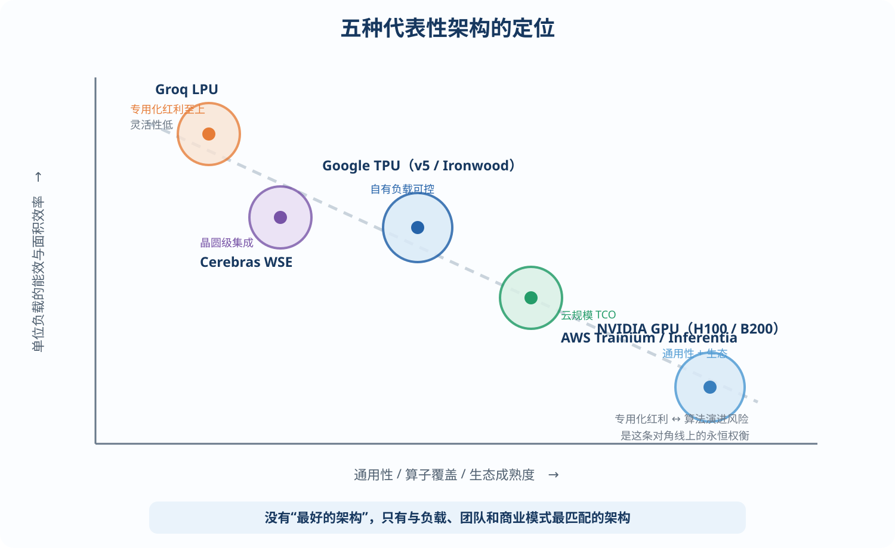

# 第 7 章 业界案例深度剖析

本章解剖五种代表性架构。读案例的正确姿势不是背参数，而是回答三个问题：**它假设的核心负载是什么？它把晶体管押注在哪里？它为此牺牲了什么？** 建议每读完一节，合上书用这三问复述一遍。

## 7.1 Google TPU：脉动阵列路线的集大成者

TPU v1（2015 年部署，其 ISCA 2017 论文是本领域第一必读）的设计动机极其朴素：数据中心神经网络推理负载暴涨，需要比 GPU 高一个数量级的每瓦性能。其架构处处体现“极简换极效”：一个 256×256 的 INT8 脉动阵列（65536 个 MAC，92 TOPS）+ 28 MB 片上统一缓冲 + 8 GB DDR3 权重内存；主机经 PCIe 下发十余条 CISC 粗粒度指令（读权重、矩阵乘、激活……），片上按序执行——没有 cache、没有分支预测、没有乱序，确定性的延迟恰好契合在线服务对尾延迟的苛刻要求（即 3.7 节的“风格一”）。

论文同样诚实地暴露了短板：DDR3 只有 34 GB/s 带宽，多数负载 memory-bound，阵列利用率不高——1.0 版 TPU 用自己的身体完整预演了本教程第 2、4 章的全部论点。

此后各代的演进就是对症下药：v2/v3 换上 HBM 并支持 BF16 以兼顾训练；v4 引入 3D Torus 与光路可重构互连（OCS），组成 4096 芯片的 pod；v5e/v5p 分化出成本优化与性能优化两条产品线；第六代 Trillium 与第七代 Ironwood 进一步强化推理定位——Ironwood 单芯片 FP8 算力 4.6 PFLOPS、192 GB HBM3E(7.4 TB/s)，最大 9216 颗芯片组成超级 pod，并为大规模 MoE 推理强化了片间集合通信与 SparseCore（嵌入/路由类稀疏访存加速）。

TPU 的启示：**“脉动阵列 + 软件定义调度”这条极简路线，靠一个强编译器栈（XLA）与自家可控的负载，持续吃了十年红利**；其风险敞口（对新算子的适应性）由 Google“算法—编译器—芯片”三位一体的组织结构来对冲——组织能力本身就是架构选择的一部分。

## 7.2 Groq LPU：确定性执行与 SRAM-only 的极致

Groq LPU 是“为 decode 延迟不惜一切”的标本，做了两个激进决策。

**其一，权重全部驻留片上 SRAM**（每芯片 230 MB，聚合带宽约 80 TB/s，为 HBM 方案的 10~20 倍），彻底不用 DRAM——第 2 章证明的 decode 带宽瓶颈就此消失。

**其二，完全确定性的静态调度**（3.7 节“风格三”的极致）：芯片上没有仲裁器、没有 cache、没有握手，编译器把每一拍每个功能单元的动作、每个数据在片上与片间网络中的行进路线全部静态排定；多芯片系统中连片间链路每一拍传什么都是编译期决定的，同步无需任何协议开销。

结果是惊人的单流速度：70B 级模型数百 token/s，远超同期 GPU。代价同样极端：70B INT8 模型需要数百颗芯片组成流水线，系统成本高、灵活性低，对动态负载（MoE 路由、变长 batch）天然别扭。

启示：**把一个约束（单流延迟）推到极端，架构会呈现完全不同的形态**；它同时是“编译器团队实力决定架构可行性”的最佳例证。

## 7.3 Cerebras WSE：晶圆级集成

Cerebras 干脆不切割晶圆：WSE-3 用一整片 300mm 晶圆做成单“芯片”——4 万亿晶体管、约 90 万个核、44 GB 片上 SRAM、21 PB/s 的聚合 SRAM 带宽。海量片上存储与近邻互连使其推理速度同样极快（与 Groq 同属 SRAM 阵营），并天然免除了绝大部分片间通信。

其独有的工程挑战极具教学价值：跨光罩布线（与代工厂合作在划片槽上做互连）、坏核冗余与自动绕行（整片晶圆必有缺陷，靠架构冗余保良率）、两万安培级的供电传输、整晶圆水冷、热膨胀匹配的封装。

启示：**集成度每上一个台阶，竞争的重心就从逻辑设计滑向物理工程**；同一个架构赌注（SRAM-only）可以有截然不同的系统实现路径。

## 7.4 NVIDIA GPU：通用性与生态的护城河

把 GPU 当“对照组”研究同样重要。H100/B200 的技术要点：Tensor Core 以小分块矩阵乘为原语、依靠寄存器级操作数复用；TMA（张量内存加速器）执行异步分块搬运，把访存与计算解耦（可视为硬件化的双缓冲 DMA）；Transformer Engine 动态管理 FP8 缩放因子；NVLink 域内 72 颗 GPU 共享内存语义（NVL72 机柜），大幅摊薄 TP 并行的通信成本；B 系列进一步支持 FP4/MXFP 微缩放格式。

GPU 的单点能效不及专用芯片，但三点让它持续统治：**算子覆盖的完备性**（任何新模型发布当天就能跑）、**CUDA 生态与十几年 kernel 优化的沉淀**、**训练推理同构带来的资源池化弹性**。

自研芯片的商业论证必须诚实回答：“我比 GPU 好的那 3~5 倍，是否足以覆盖自建软件栈与放弃生态的成本？”——对拥有海量稳定自有负载的大模型公司，答案越来越多是肯定的，这正是自研潮的商业逻辑。

## 7.5 AWS、Meta 与其他自研阵营

**AWS Trainium/Inferentia**：其 NeuronCore 是“脉动阵列张量引擎 + 向量引擎 + 标量引擎 + 显式管理 SRAM”的教科书式组合；Trainium2 单卡 96 GB HBM3，16 卡经 NeuronLink 组成 Trn2 服务器，并以数十万芯片级的集群（Project Rainier）支撑 Anthropic 等伙伴的负载。其公开的 NKI kernel 编程文档是学习“显式内存层次编程模型”的优质材料。

**Meta MTIA**：v1/v2 针对推荐模型推理（海量嵌入查表 + 中小矩阵乘）设计——8×8 PE 网格、大 SRAM、RISC-V 控制核，并逐步向生成式负载扩展；它展示了“负载画像不同，芯片形态随之不同”的另一极。

**其他值得跟踪的**：Microsoft Maia、OpenAI 与 Broadcom 合作的自研加速器、Tenstorrent 的 RISC-V 众核路线，以及国内的昇腾（达芬奇架构：3D Cube 矩阵单元 + 向量单元的组合）、寒武纪等。建议作为团队研讨作业，用“三问框架”逐一拆解。

## 7.6 横向对比与设计哲学总结

| 架构 | 核心赌注 | 存储策略 | 控制/调度 | 牺牲了什么 |
|---|---|---|---|---|
| Google TPU | 自有负载可控，极简专用化 | HBM+大SRAM，脉动阵列复用 | 粗粒度指令+XLA编译器 | 对外部生态/新算子的敏捷性 |
| Groq LPU | 单流延迟压倒一切 | SRAM-only（230MB/片） | 全静态确定性调度 | 系统成本、动态负载灵活性 |
| Cerebras WSE | 晶圆级集成消灭片间通信 | 44GB 片上 SRAM | 数据流+静态映射 | 良率/散热工程复杂度、单点造价 |
| NVIDIA GPU | 通用性+生态 | HBM+缓存层次+TMA | SIMT 动态调度 | 单位负载的能效与面积效率 |
| AWS Trainium | 云规模 TCO，垂直整合 | HBM+显式 SRAM | 多引擎+Neuron 编译器 | 生态成熟度（以自家云负载对冲） |

*图 7-1　五种代表性架构的定位：专用化红利与算法演进风险的权衡*

五个案例共同指向本教程反复强调的方法论：**先锁定负载与商业目标 → 推导瓶颈（几乎总在存储与互连）→ 选择赌注并诚实接受其代价 → 用软件栈能力兜底灵活性风险。** 没有“最好的架构”，只有与你的负载、团队和商业模式最匹配的架构。
